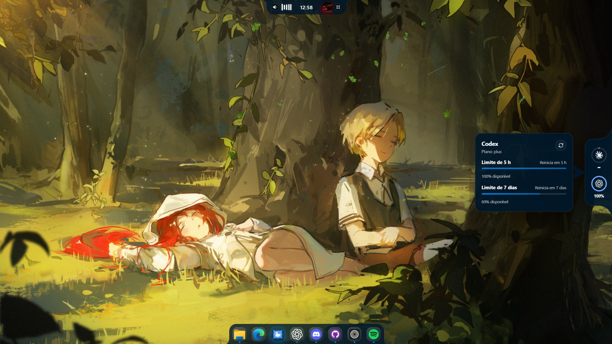
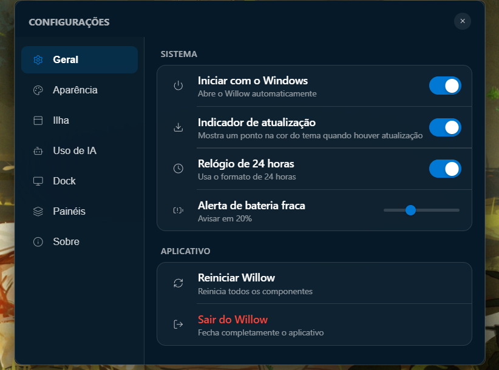

# Willow

Willow é um aplicativo para Windows que reúne uma ilha dinâmica, um dock personalizável, controles do sistema e monitoramento de limites de assistentes de IA.

<p align="center">
  
</p>

## Prévia

<p align="center">
  
</p>

<p align="center"><em>Ilha dinâmica, monitor de uso de IA e dock integrados à área de trabalho.</em></p>

### Ilha dinâmica

<p align="center">
  
</p>

<p align="center">
  
</p>

<p align="center">
  
</p>

<p align="center">
  
</p>

<p align="center">
  
</p>

### Dock

<p align="center">
  
</p>

### Configurações

<p align="center">
  
</p>

## Recursos

• Ilha superior com relógio, calendário, temporizador e controles de mídia

• Gatilho da ilha ajustável por posição, largura e altura para não cobrir abas do navegador

• Controles de volume e brilho na esfera esquerda e aplicativos na esfera direita

• Painel de uso de IA com atualização manual e automática a cada cinco minutos

• Leitura de limites disponíveis para Codex, Claude, Cursor, Grok e OpenCode

• Detecção local de Antigravity e GLM

• Dock para substituir a barra de tarefas do Windows

• Prévia de janelas, aplicativos fixados e atalhos Win mais número

• Seção separada no dock para unidades conectadas, Downloads, Documentos, Imagens e Lixeira

• Willow Journal mensal com calendário, diário, semana, gráfico de sono e controle de hábitos

• Banco SQLite local com salvamento automático, desfazer, refazer e exportação por impressão

• Resumo do Journal integrado à ilha e progresso diário no ícone opcional do dock

• Clima, bateria, CPU, memória, disco e rede

• Detecção de notebook ou desktop por recursos reais, ocultando bateria e brilho indisponíveis

• Tema escuro, claro, personalizado e adaptável

• Cor unificada entre a ilha, o dock, o monitor de IA e os indicadores

• Interface em português

## Privacidade

Willow lê somente os arquivos locais de sessão necessários para consultar os limites das contas já conectadas. Tokens não são enviados para a interface, não aparecem em logs e não são gravados novamente. Cada credencial é usada apenas com o serviço que a criou. O Willow Journal fica no banco `willow-journal.sqlite3` da pasta de dados locais do aplicativo e não é enviado para serviços externos.

## Requisitos

• Windows 10 ou Windows 11

• WebView2

• Bun 1.4 ou mais recente

• Rust estável com o alvo MSVC

• Visual Studio Build Tools com Desenvolvimento para desktop com C++

## Desenvolvimento

Instale as dependências:

```powershell
bun install
```

Abra o aplicativo em modo de desenvolvimento:

```powershell
bun run tauri dev
```

Valide a interface:

```powershell
bun run build
```

Valide o código nativo:

```powershell
cd src-tauri
cargo check --locked
cargo test --locked
```

## Organização

```text
src/
  components/       componentes da ilha e do dock
  hooks/            sincronização de configurações e clima
  icons/            ícones usados pela interface
  settings/         páginas e estado das configurações
  types/            contratos compartilhados do frontend
src-tauri/
  src/ai_usage.rs   leitura segura dos limites de IA
  src/commands.rs   comandos enviados pela interface
  src/journal.rs    banco SQLite e janela do Willow Journal
  src/services.rs   integrações de longa duração com o Windows
  src/utils.rs      armazenamento e utilitários
  icons/            ícones do executável e do instalador
public/             ativos públicos
scripts/            automação de versão e lançamento
```

## Limites de IA

As integrações usam sessões já existentes no computador. Willow não realiza login em nome do usuário.

• Codex consulta o limite atual e usa a sessão local mais recente como alternativa

• Claude consulta os limites das contas encontradas em pastas de perfil locais

• Cursor usa a sessão do editor em modo somente leitura

• Grok usa a sessão criada pelo comando de login do próprio cliente

• OpenCode consulta o plano Go quando a sessão compatível está disponível

• Antigravity e GLM são detectados localmente e aparecem quando instalados

## Atualizações

O Willow consulta a versão mais recente publicada em [GitHub Releases](https://github.com/vitorcgo/Willow/releases). A verificação ocorre ao iniciar e, enquanto o aplicativo permanecer aberto, a cada quatro horas. Quando encontra uma versão superior à instalada, mostra o indicador de atualização e abre a página oficial de download após a confirmação do usuário.

Para publicar uma atualização para todos os computadores:

1. Finalize e envie as mudanças para a branch `main`.
2. Execute `bun run release X.Y.Z`, substituindo `X.Y.Z` pela nova versão.
3. O script atualiza os arquivos de versão, cria a tag e a envia ao GitHub.
4. O workflow `Release` compila o instalador e publica a nova versão.

A versão publicada precisa ser maior que a versão instalada. A instalação continua manual e segura pela página oficial de lançamento, sem executar downloads silenciosos.

## Licença

Willow é distribuído sob a GNU General Public License, versão 3. Consulte [LICENSE](LICENSE) e [THIRD_PARTY_NOTICES.md](THIRD_PARTY_NOTICES.md).
