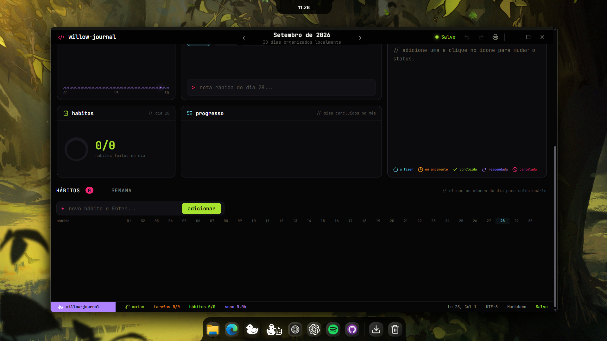

# Willow

<p align="center">
  
</p>

<p align="center">
  Uma ilha dinâmica, um dock nativo e um espaço de organização local para Windows.
</p>

<p align="center">
  <a href="https://github.com/vitorcgo/Willow/releases">Baixar a versão mais recente</a>
  ·
  <a href="SETTINGS.md">Guia de configurações</a>
  ·
  <a href="CONTRIBUTING.md">Contribuir</a>
</p>

Willow integra recursos do sistema sem transformar a área de trabalho em um painel pesado. A interface foi feita para permanecer discreta, responder rápido e manter configurações e dados pessoais no próprio computador.

## Visão geral

<p align="center">
  
</p>

| Área           | O que oferece                                                            |
| -------------- | ------------------------------------------------------------------------ |
| Ilha           | Relógio, calendário, temporizador, mídia, clima e indicadores do sistema |
| Dock           | Aplicativos fixados, janelas abertas, prévias e atalhos locais           |
| Journal        | Calendário mensal, diário, tarefas, hábitos, sono e anotações semanais   |
| Painel de IA   | Consulta opcional de limites de uso das contas locais compatíveis        |
| Personalização | Temas, cor, materiais, escala, comportamento e widgets                   |

## Willow Journal

O Journal abre em uma janela própria, usa banco SQLite local e salva automaticamente. Ele inclui histórico de desfazer e refazer, impressão organizada, calendário mensal, diário, tarefas, hábitos, sono e planejamento semanal.

<p align="center">
  
</p>

Os dados ficam em `willow-journal.sqlite3`, dentro da pasta local de dados do aplicativo. Nenhuma informação do Journal é enviada para serviços externos.

## Ilha dinâmica

<p align="center">
  
</p>

<p align="center">
  
</p>

<p align="center">
  
</p>

O gatilho superior pode ser ajustado por posição, largura e altura. Em navegadores, uma proteção específica mantém as abas clicáveis e exige uma breve permanência na borda superior para abrir a ilha.

## Dock

<p align="center">
  
</p>

- Aplicativos fixados e janelas em execução
- Reordenação por arrastar
- Prévias de janelas
- Atalhos `Win + 1` até `Win + 9`
- Willow Journal fixo na área direita
- Seção opcional para unidades, Downloads, Documentos, Imagens e Lixeira
- Modos fixo, inteligente e espiar

## Recursos do sistema

<p align="center">
  
</p>

<p align="center">
  
</p>

Willow detecta se o dispositivo é um notebook ou desktop. Recursos sem hardware correspondente, como bateria ou brilho interno, são ocultados automaticamente.

## Painel de uso de IA

O painel lateral é opcional e começa desligado em novas instalações. Quando ativado, consulta somente as sessões que já existem no computador e pode mostrar limites disponíveis de Codex, Claude, Cursor, Grok, OpenCode, Antigravity e GLM.

Tokens não aparecem na interface, não são enviados para o Willow e não são gravados novamente. Cada credencial é usada apenas para consultar o serviço que a criou.

## Configurações

<p align="center">
  
</p>

As configurações controlam tema, cor, transparência, escala, ilha, dock, painel de IA, indicadores e atualizações. A inicialização com o Windows permanece ativa para que o dock e a ilha estejam disponíveis após o login.

## Requisitos

- Windows 10 ou Windows 11
- Microsoft Edge WebView2
- Bun 1.4 ou mais recente para desenvolvimento
- Rust estável com alvo MSVC
- Visual Studio Build Tools com Desenvolvimento para desktop com C++

## Desenvolvimento

Instale as dependências:

```powershell
bun install
```

Execute o aplicativo em modo de desenvolvimento:

```powershell
bun run tauri dev
```

Valide o frontend e o código nativo:

```powershell
bun run build
cd src-tauri
cargo fmt --check
cargo clippy --all-targets --all-features -- -D warnings
cargo test
```

## Estrutura do projeto

```text
src/
  components/       ilha, dock e componentes compartilhados
  hooks/            sincronização de configurações e integrações
  settings/         páginas e estado das configurações
  types/            contratos do frontend
src-tauri/
  src/ai_usage.rs   leitura local dos limites de IA
  src/commands.rs   comandos expostos à interface
  src/journal.rs    banco SQLite e janela do Journal
  src/services.rs   integrações contínuas com o Windows
  src/utils.rs      armazenamento e utilitários
  icons/            ícones do executável e do instalador
docs/screenshots/   imagens usadas na documentação
scripts/            versionamento e publicação
```

## Atualizações e releases

Willow verifica no GitHub se existe uma versão mais recente. Quando encontra uma atualização, avisa o usuário e abre a página oficial de download após confirmação.

Para publicar uma versão:

1. Valide e envie as mudanças para `main`.
2. Execute `bun run release X.Y.Z`.
3. Confirme a tag criada e enviada ao GitHub.
4. Aguarde o workflow `Release` publicar o instalador.

A versão publicada deve ser superior à instalada. O download e a instalação continuam explícitos, sem atualização silenciosa.

## Licença

Willow é distribuído sob a [GNU General Public License 3.0](LICENSE). Dependências e avisos adicionais estão em [THIRD_PARTY_NOTICES.md](THIRD_PARTY_NOTICES.md).
